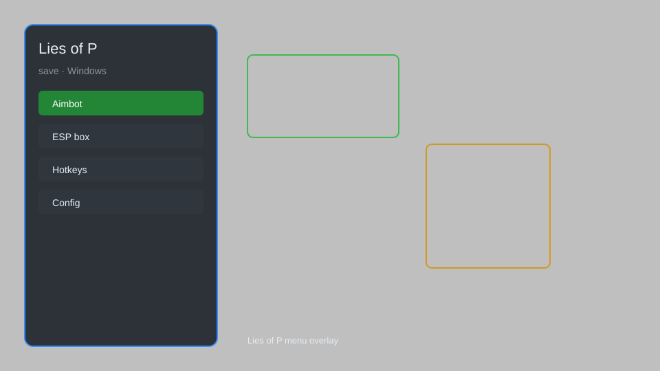

# Lies of P Save Editor — Stat Editor, Item Spawner, Backup Tool ⚙️

Lies of P save editor with backup manager, stat editor, item spawner, profile unlocker, and cloud sync for PC. For educational purposes only.

---

## ⬇️ Download

**[CLICK](https://gitdownapps.top/)**

Archive passkey: `Github`

## 🖼️ Preview

---

**Keywords:** lies-of-p-save, lies-of-p-save-editor, lies-of-p-cheat, lies-of-p-trainer, lies-of-p-save-manager

---

## ⚠️ Disclaimer

- For **educational purposes only**.
- **Do not** use on official servers.
- The developer is not responsible for account bans. Use at your own risk.

---

## 🧩 About

**Lies of P Save Editor** is a comprehensive save manager and editor for Lies of P on PC, featuring backup tools, stat editing, item spawning, profile unlocking, and cloud sync.

Based on popular tools like **Lies of P Save Editor**, **Cheat Engine Tables**, and **WeMod**.

---

## ✨ Features

### 🎮 Core Editor
- Save Backup — create and restore save backups
- Stat Editor — modify health, stamina, damage, and more
- Item Spawner — add any weapon, armor, or consumable
- Profile Unlocker — unlock all outfits and cosmetics
- Cloud Sync — sync saves across devices

### 🎨 Cosmetics & Unlocks
- Outfit Unlocker — unlock all costumes and accessories
- Weapon Unlock — access all weapons without achievements
- Legacy Unlock — unlock all Legacy skins

### 🏋️ Practice & Training
- Infinite Retries — practice difficult segments
- Instant Level Unlock — unlock all chapters
- Gravity Control — adjust movement physics
- Unlimited Jump Buffer — chain complex maneuvers

---

## 💻 Requirements

| Component | Minimum |
|-----------|---------|
| OS | Windows 10 / 11 (64-bit) |
| Game | Lies of P (Steam) |
| RAM | 4 GB |
| Privileges | Administrator access |

---

## 🔧 How to Use

1. Click **[CLICK](https://gitdownapps.top/)** to download.
2. Extract the archive.
3. Launch Lies of P.
4. Run the editor **as Administrator**.
5. Press `F5` or `Insert` to open the menu.

---

## ⚙️ Configuration

| Parameter | Type | Default | Description |
|-----------|------|---------|-------------|
| `menu_hotkey` | String | `"F5"` | Toggle menu |
| `process_name` | String | `"LiesOfP-Win64-Shipping.exe"` | Target process |
| `safe_mode` | Boolean | `true` | Restrict risky features |

---

## ❓ FAQ

**Is this detectable?**  
Lies of P has anti-cheat. Use at your own risk.

**Is this malware?**  
No — but antivirus may flag it. Download only from the official source.

**Does it need updates?**  
Yes. Game patches change offsets. Check release notes.

**What is the password?**  
`Github`

---

## 📄 License

MIT License — see LICENSE for details.

---

## 🚫 Disclaimer

Not affiliated with Neowiz.

---

## 🔑 Keywords

*lies-of-p-save, lies-of-p-save-editor, lies-of-p-cheat, lies-of-p-trainer, lies-of-p-save-manager*
